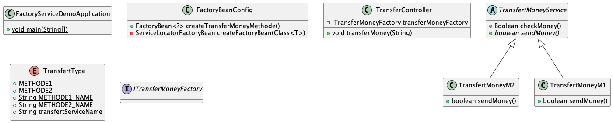

# FactoryServiceDemo
In this program we build a program with a factory service, according the name of the service. 

For test, you must set the name (methode1 or methode2) on Get Api call, like this:

```
curl --location 'http://localhost:8080/methode1'
``` 
or
```
curl --location 'http://localhost:8080/methode2'
```



